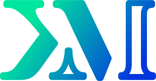

    
  
    

Hello world! As you can see on my profile, my name is Kevin Marques and I'm a Brazilian software developer that really loves technology and doing software. Currently, I'm studying to become a **full-stack developer** :sparkles: someday and this Github account is where I share my projects and contribuitions, hope you enjoy some of my work. Also, if you want some help, feel free to get in touch!

:link: [Email](mailto:kevinmarquesp478@protonmail.com) **|** [Discord](http://discordapp.com/users/n_station) **|** [Blog](https://kevinmarquesp.github.io)

### More Detailed Information
I'm still studying some of the most important subjects in technology yet, but I'm happy to say that I'm comfortable enough to deal with **Docker images**, **SQL databases** and **Regex**. Besides coding, my hobbies include exploring new things -- I started learning **Spanish** recently --, writing articles on my personal blog and drawn manga, graffiti or other cool art styles.

+ **My favorite repositories**:
  + [**`shopping_app`**](https://github.com/kevinmarquesp/shopping_app): First working webapp that I've did when I was still learning;
  + [**`old-portfolio-vuejs`**](https://codeberg.org/kevinmarquesp/old-portfolio-vuejs): Just a front-end project I was trying to create my personal portfolio web page;
  + [**`ParallelServo`**](https://github.com/kevinmarquesp/ParallelServo): An Arduino library that allows you to control multiple servos at the same time;
  + [**`old-portfolio-astrojs`**](https://codeberg.org/kevinmarquesp/old-portfolio-astrojs): I was using this project to learn AstroJS, it was fun;
  + [**`random-number-generator`**](https://github.com/kevinmarquesp/random-number-generator): A web page that generates strings of random numbers;
  + [**`flappy_bird`**](https://codeberg.org/kevinmarquesp/flappy_bird): Another Flappy Bird clone, I used it to learn the Löve2D game engine;
+ **Other services that I have an account**:
  + You can find my front-end experiments on my [**CodePen** profile](https://codepen.io/kevinmarquesp);
  + Old/archived projects or test repos you can check out on my [**Codeberg** profile](https://codeberg.org/kevinmarquesp/);
  + I used [**GitLab**](https://gitlab.com/kevinmarquesp) in the past and put some projects there.

My favorite languages and technologies:  

Technologies that I'm still learning:  

Things that I'll study next:  

What I use on my development enviroment:  

   

