### Olá, me chamo Kevin Marques 👋
🔥 *Um estudante de programação e desenvolvedor web junior.*

#### Tecnologias que eu uso

- **Linguagens que aprendi:** HTML, CSS e Scss, JavaScript e React com NextJS.
- **Outras linguagens que sei umpouco:** Bash e Python.
- **Linguagens que pretendo aprender:** Go, C++, Rust, C e Ruby.

---

  <em>Linguagens citadas acima</em>
   
  &nbsp;&nbsp;&nbsp;&nbsp;
  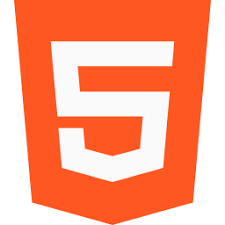
  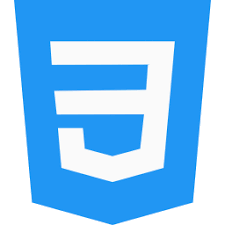
  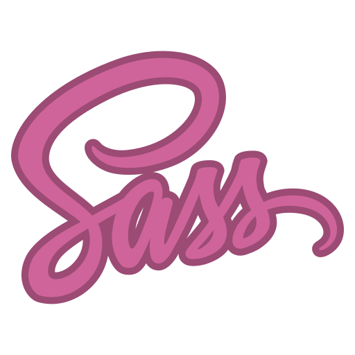
  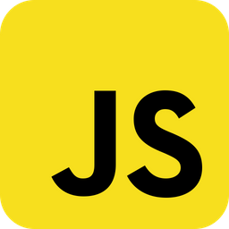
  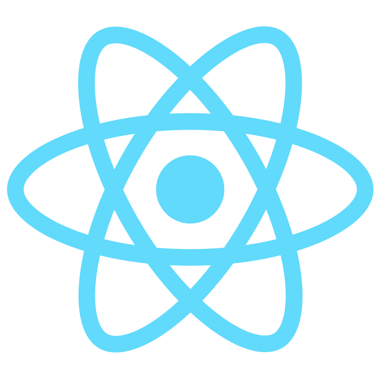
  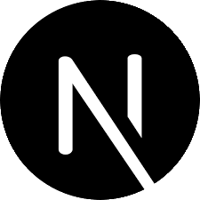
  &nbsp;&nbsp;&nbsp;&nbsp;
  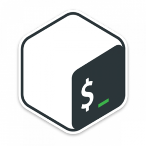
  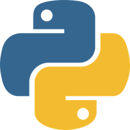
   
   
  <em>O que uso para desenvolver</em>
   
  &nbsp;&nbsp;&nbsp;&nbsp;
  
  
  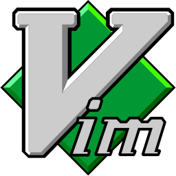
  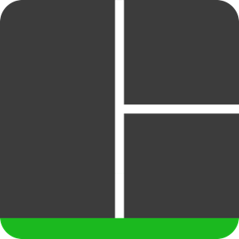
  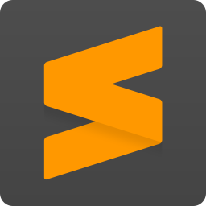

