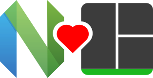

<!--
:::: Introdução do perfil
--->

<h2>
  
    Hello world! I'm Kevin Marques
  
  &nbsp;
  
</h2>

<em>🔥 I'm just a geek who's studing web developmment</em>

    
  
      

<!--
:::: Coisas que ainda estou aprendendo
--->

<h3>
  Skills 💪
</h3>

<ul>
  <li>
    
      <strong>
        What I learned:
      </strong>
    
     
    
      
      
      
      
      
    
  </li>
   

  <li>
    
      <strong>
        I know how to get by with:
      </strong>
    
     
    
      
      
      
    
  </li>
   

  <li>
    
      <strong>
        Stuffs that I'm interested in:
      </strong>
    
     
    
      
      
      
      
      
    
  </li>
</ul>

<!--
:::: Github Stats
--->

## 

   
  
  
    
  

