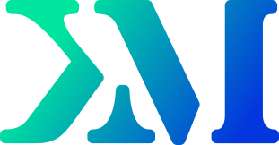

<!-- Custom wave decorator (top) -->

 
 
 

<!-- Personal logo block -->

  

 
 

Self-taught software engineer student who cares more about how code is built than what it was built with. I've worked across enough stacks to know that good architecture is language independent — the same principles that make a Go service maintainable are the ones that make a TypeScript frontend reliable. Looking for my first role where I can bring that attention to structure to a real team.

## Blog Posts

+   [Explaining The Repositories/Services Pattern](https://kevinmarquesp.github.io/blog/240729-2117/) (PT-BR)
+   [Let's talk about VS Code](https://kevinmarquesp.github.io/blog/240316-1424/)
+   [WebCrawlerEx, Just A Silly Elixir Exercise](https://kevinmarquesp.github.io/blog/240204-1143/)
+   [Multitasking With An Arduino UNO Board](https://kevinmarquesp.github.io/blog/240301-1148/) (PT-BR)
+   [Error Handeling With Python](https://kevinmarquesp.github.io/blog/240304-1623/) (PT-BR)

[🔗 Read more](https://kevinmarquesp.github.io)

<!-- My skills shown in icons -->

 
 

  

  

<!-- Custom wave decorator (bottom) -->
 
 

